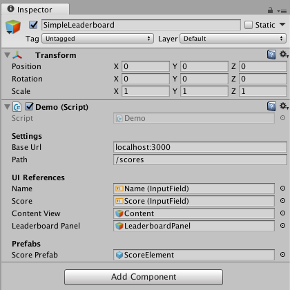

# Simple Leaderboard
This package is designed to provide a very simple leaderboard with very little configuration required. It is designed to be used with [leaderboard-js](https://www.github.com/goibon/leaderboard-js) as backend but can easily be used with others as well.

Requests are asyncronous and the request methods provided by the `Leaderboard` class are designed to be used as [Coroutines](https://docs.unity3d.com/Manual/Coroutines.html).

## Usage

Setup is simple, only a base url and optionally a default path needs to be set on the `Leaderboard` class:

```csharp
// Setup Leaderboard properties
Leaderboard.BaseUrl = "https://mysimpleleaderboard.io";
Leaderboard.DefaultPath = "/scores";

```
After that requests can be sent and resolved like this:
```csharp
StartCoroutine(
    Leaderboard.Get(result =>
    {
        if (string.IsNullOrEmpty(result))
        {
            Debug.Log("Did not get any submissions.");
            return;
        }
        var submissions = JsonConvert.DeserializeObject<Submission[]>(result);
        PopulateLeaderboardUI(submissions);
    }));
```
To send a submission to the backend using the `Submission` struct.
```csharp
var submission = new Submission();
submission.Name = "Kasper";
submission.Score = 9000.1f;
// Here PostCallback is a method declared somewhere else instead of a lambda expression.
StartCoroutine(Leaderboard.Post(submission.ToDictionary(), PostCallBack));
```

### Demo Scene
To use the demo scene simple enter the url of your backend into the `SimpleLeaderboard` gameobject in the inspector and run the scene.


## Contents of this package
### Overview

* Leaderboard.cs : Static class for performing web requests.
* Demo/ : Folder containing a small demo project that shows how to use this package.
  * Demo.cs : Class that binds to the UI in the demo scene and has an example of sending requests and handling responses.
  * Demo.unity : Scene with a basic leaderboard UI and input fields for sending requests.
  * Prefabs/ : Folder containing prefabs used in the demo scene.
    * ScoreElement.prefab : Prefab representing a single entry in the leaderboard.

### Leaderboard.cs
Static class `Leaderboard` used to perform web requests to the backend.

This class has two primary methods: `Get` and `Post` used for sending requests and a struct, `Submission`, designed to be used to represent the data of a leaderboard entry . The use of `Submission` is optional and is provided to relieve the user of this package of some implementation work.

#### `public static IEnumerator Get(Action<string> callback = null, string path = null)`
Sends a  `GET` request, optionally taking a path as argument, and passes the response from the backend as a `string` to `callback`.

#### `public static IEnumerator Post(Dictionary<string, string> formData, Action<string> callback = null, string path = null)`
Sends a `POST` request with `formData` in the body, optionally taking a path as argument, and passing the response as a `string` to `callback`

### Demo
This folder contains a demo scene with a submission form for testing out the `Get` and `Post` methods of `Leaderboard` and demonstrating how they can be used. It also provides an example of how to display the entries submitted in  scrollable UI.
